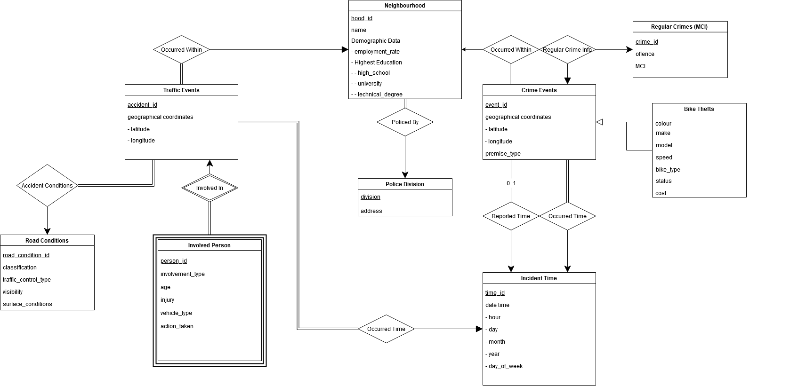
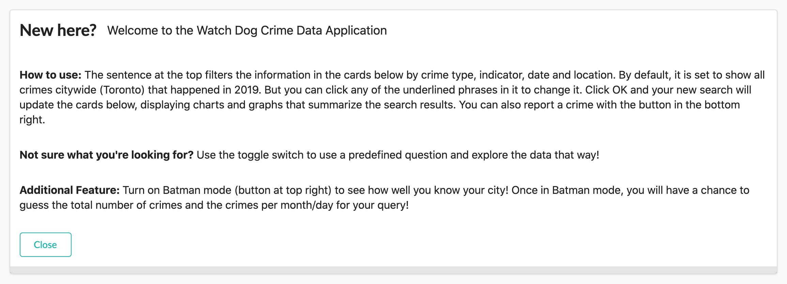
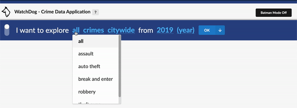
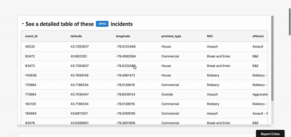
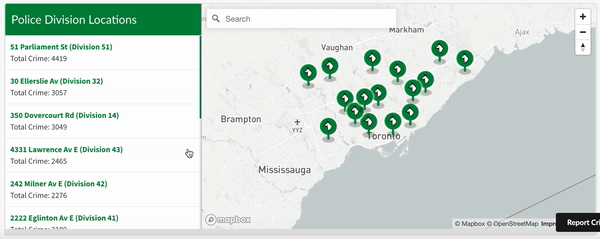

# WatchDog

## Overview

WatchDog is an interactive web app for people interested in exploring crime in the city of Toronto. The webapp is helpful to a wide variety of users such as new homeowners trying to assess how safe a neighbourhood is before buying, novice drivers trying to avoid accident-prone roads or just anyone curious about crime rates in their neighbourhood.

#### Application
- https://watch-dog.azurewebsites.net/

#### Demo Video:
- https://www.youtube.com/watch?v=VbmVv0VzuPU

## Data

The tables we get from the Toronto Police Open Data:
- https://data.torontopolice.on.ca/pages/open-data

We get a few additional columns of the census from the Toronto City Open Data:
- https://open.toronto.ca/dataset/neighbourhood-profiles/

The raw data comes in the form of large CSV files that are difficult to work with. Therefore, we have created our own scripts to restructure the data into a useful format for both storage and presentation.

## Platform and Tech Stack

Both the web application and the SQL database are hosted on Microsoft Azure. Azure AppServices and MySQL are modern, scalable, efficient and flexible. This setup is ideal and efficient for building a web app such as ours; plus Azure was cheaper than the alternatives.

The back end is made up Node.js + Express.js from which API end points are exposed. This is what directly talks with the database. The front end is a React application. The notalable NPM packages used include: the Semantic UI React library for UI components, the Mapbox API for the maps you see in the application, ChartJS and D3.js for the data presentation, and ag-grid for the table. Thus, our web application code mostly consists of JavaScript.

## E/R diagram

## Using the Application

### Welcome Card

### Starter Question

* Located at very top of the application.
* It filters the information in the cards below by crime type (regular crimes, bike thefts and traffic accidents).
* For crimes we have filters for the major crime indicator (MCI), date (year or month) and location (citywide, neighbourhood and police division).
* By default, it is set to show all crimes citywide (Toronto) that happened in 2019.
* Click OK and the new search will update the cards below.

### Data Cards
*  All queries have similar cards with different data.

#### Table Card

   * Located right below the Starter Question.
   * Contains the raw data from the query.
   * Paginated and filterable.

#### Heat Map Card

   * Located right below the Table Card.
   * Shows the amount of crimes per time period.
   * Interact to refine the time range.

#### Summary Card

    
    
    

   * Crimes: shows the number of crimes per major crime indicator.
   * Bike Thefts: shows the number of bike thefts per bike type
   * Traffic Accidents: shows the number of traffic accidents per type of the person involved person

#### Cluster Map Card

   * Shows each individual event location.
   * We can zoom in on the cluster to break it up and see individual locations.

#### Line Chart Card

   * Shows the number of event per month if our date type is set to year, or day if our date type is set to month.

#### Horizontal Bar Chart

   * Same data as summary

#### Doughnut Chart

   * Same data as summary
   * Traffic Accidents:
        * shows the number of traffic accidents per road classification
        * shows the number of traffic accidents per road surface condition

#### Pie Chart

   * Crimes: shows the number of crimes per premise type
   * Bike Thefts: shows the number of bike thefts per bike status
   * Traffic Accidents: shows the number of traffic accidents per road visibility

### Police Division Map

   * Located below everything mentioned above.
   * Shows the amount of crimes per police division and where the police divisions are located.
   * Provide an address and the application will output the closest police division.

## API

### GET Requests

### General

- List of neighbourhoods
  - `/neighbourhoods/`
- List of Police Divisions
  - `/police-divisions/`
- List of crime indicators
  - `/regular-crimes/`

Can filter the following by date, neighbourhood, and/or police division

### Crimes

Can also filter all of these by MCI

- List of crime events
  - `/crime-events/table/`
- Summary of number of crime events per MCI
  - `/crime-events/summary/MCI`
- Summary of number of crime events per premise type
  - `/crime-events/summary/premise`
- List of crime locations (lat and long)
  - `/crime-events/map/`
- Summary of number of crime events by police division
  - `/crime-events/summary/police-division`
- Summary of crime events per month (if year supplied as timeType) or per day (if month supplied as timeType)
  - `/crime-events/summary/time`
- Summary of crime events per date (month, day, and hour)
  - `/crime-events/heatmap/year`

### Bike Thefts

- List of bike thefts
  - `/crime-events/bike-thefts/table/`
- Summary of number of bike thefts per bike type (can filter by bike type)
  - `/crime-events/bike-thefts/summary/type`
- Summary of number of bike thefts per bike status (can filter by bike status)
  - `/crime-events/bike-thefts/summary/status`
- List of bike theft locations (lat and long)
  - `/crime-events/bike-thefts/map/`
- Summary of number of bike thefts by police division
  - `/crime-events/bike-thefts/summary/police-division`
- Summary of bike thefts per month (if year supplied as timeType) or per day (if month supplied as timeType)
  - `/crime-events/bike-thefts/summary/time`
- Summary of bike thefts per date (month, day, and hour)
  - `/crime-events/bike-thefts/heatmap/year`

### Traffic Accidents

- List of traffic accidents
  - `/traffic-events/table/`
- Summary of number of traffic accidents per RoadCondition column (classification, visibility, surface_condition)
  - `/traffic-events/summary/road/:cat`
- Summary of number of traffic accidents per InvolvedPerson involvement_type
  - `/traffic-events/summary/type`
- List of traffic accidents locations (lat and long)
  - `/traffic-events/map/`
- Summary of number of traffic accidents by police division
  - `/traffic-events/summary/police-division`
- Summary of traffic accidents per month (if year supplied as timeType) or per day (if month supplied as timeType)
  - `/traffic-events/summary/time`
- Summary of traffic accidents per date (month, day, and hour)
  - `/traffic-events/heatmap/year`

### Predefined Question

- Predefined question & answer queries (see `questions.js`)
  - `/question/:questionNum`

### POST Requests

- Report a crime
  - Expects a JSON object with each column of CrimeEvent and, the columns for IncidentTime
  - `/report-crime/`

# Team
WatchDog was created by Dhvani, Vikram, Lukman, Abdullah, and Chandana for the CS 348 course at UWaterloo.
